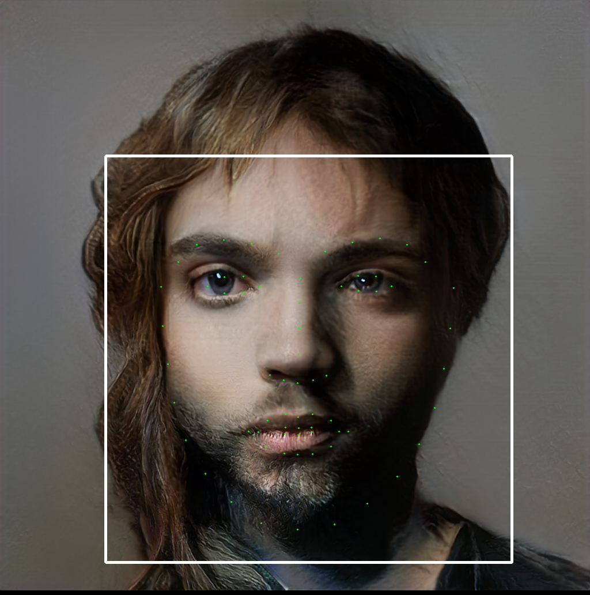

# Narcissus:

This is my implementation of the system behind my artwork, Narcissus.

**Pictures:** Some imaginary celebrities created by Narcissus.

## Description

Narcissus is an interactive art installation which takes an image of the viewer, compresses that image into a set of descriptive features, and produces the "reflection" of those features as a neural network sees it. Particularly, this Generative Adversarial Network (GAN) draws the viewer's reflection from its artificial, distinctly neural "latent" space which it learns from its training dataset. I trained the GAN on a well-known celebrity face dataset, CelebA-HQ, meaning that the neural network will learn the functions that represent faces of celebrities. Narcissus intends to raise more self-reflecting questions in the viewer than it answers, many of which are becoming increasingly relevant.

When the viewer looks into the mirror and sees a foreign face stare back, similarities and differences are visceral. What makes a celebrity face different than ours? How do the deep-seated biases inherent in our everyday society drive the inherent biases in the datasets we collect? How does the generated face staring back at us reflect what we deem as special, as 'celebrity', or as beautiful? How does it represent what we choose to celebrate as 'human'?

This has been one of the numerous problems posed by thinkers as we begin developing in the new age of artificial intelligence; the datasets we use to train models reflect often unconscious and undetected biases. Without sufficient checks and balances, data-driven systems can create a feedback loop resulting in an amplification of these biases, such as in [recidivism prediction](). As well as this, since data is necessarily a reduction of objective reality, models that learn only from training data will never have the full picture and there will always be cases where it lacks common sense. For example, if a model is trained on current recidivism data to predict recidivism rates, even if the data contains no information about race, the model might learn that certain crimes are committed by certain classes of people corresponding to race, and use that information to predict rates that might still be disproportionate across race.

Moving forward, as data-driven models are increasingly replacing humans in important decision-making including [punishment sentencing](), [facial recognition in HK](), and [healthcare](), we must tread carefully so as not to place blind faith in any system to not perpetuate the biases and mistakes of our current or previous societies.

On the other hand, the model often makes mistakes that seem obvious to us, producing a celebrity that looks totally different from the viewer. Even though the celebrity is a product of a transformation of the viewer's data, does it have anything to do with the viewer? This again brings to attention the point that data is a reduction of objective reality. How can we reduce the important features of a human to a representation in data? Is there a minimum amount of data that can represent a human? Corporations are collecting and consolidate data into [data lakes]() with data sources from [amazon ring]().

## Modules:
 * Face features:
     [Implementation](https://github.com/bbenligiray/greedy-face-features) of [Gacav, C.; Benligiray, B.; Topal, C., "Greedy search for descriptive spatial face features," International Conference on Acoustics, Speech and Signal Processing (ICASSP), 2017.](https://arxiv.org/abs/1701.01879)
 * Age and gender classification:

 * PG GAN for face generation:
     [Implementation](https://github.com/tkarras/progressive_growing_of_gans) of ["Progressive Growing of GANs for Improved Quality, Stability, and Variation"](https://arxiv.org/pdf/1710.10196.pdf)

## How it works:
1. Camera takes picture
2. Picture is featurized
3. Features are converted to GAN latent space with learned inverter model
4. Latent space is generated to create neural mirror image
5. Neural image is displayed

## System requirements

* Both Linux and Windows are supported.
* 64-bit Python 3.6 installation with numpy 1.13.3 or newer. We recommend Anaconda3.
* One or more GPUs to run Tensorflow on. Has been tested with a GTX 980 and works with very little lag.
* NVIDIA driver 391.25 or newer, CUDA toolkit 9.0 or newer, cuDNN 7.1.2 or newer.
* Additional Python packages listed in `requirements.txt`

## Training model
1.
